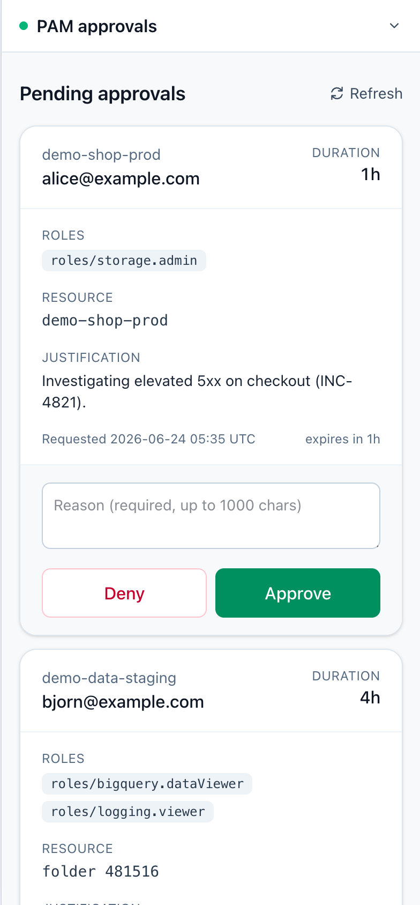

# pam-approver

[](https://github.com/schack/pam-approver/actions/workflows/cd.yml)
[](https://scorecard.dev/viewer/?uri=github.com/schack/pam-approver)

Mobile-friendly approver UI for Google Cloud Privileged Access Manager (PAM).

A **single-page app**: nginx serves static HTML/JS/CSS; the browser talks
directly to the PAM REST API using a Google OAuth access token. No backend
state, no database, no server-side credentials.

It exists because the Google Cloud console's PAM approver view is painful on a
phone — this is a thumb-friendly card UI an on-call approver can act on from
their pocket.

<p align="center">
  
</p>

## How it fits together

```
 ┌──────┐    HTTPS    ┌──────────────┐    Bearer token    ┌──────────────────────┐
 │      │ ──────────▶ │ pam-approver │     direct call    │  privilegedaccess    │
 │ user │   (IAP)     │    nginx     │ ─────────────────▶ │  manager.googleapis  │
 │      │ ◀────────── │    static    │                    │  .com                │
 └──────┘    HTML/JS  └──────────────┘                    └──────────────────────┘
                          │
                          │  loads
                          ▼
                  accounts.google.com/gsi/client   (OAuth in browser)
```

- **IAP** sits in front of the nginx pod and gates access to the static asset
  bundle. It does *not* protect the API calls — those go from the user's
  browser straight to googleapis.com.
- **Auth:** Google Identity Services token client runs in the browser,
  popup-based. Returns a 1h access token scoped to `cloud-platform`.
  No refresh tokens.
- **Per-user authorisation** is enforced by Google IAM on the PAM API:
  approvers see / can act on grants their account has `pam.grants.approve`
  on. The app does not gate anything on its own.

## Approving grants

Each pending grant card has a reason field next to Approve / Deny. Whether a
reason is mandatory follows the entitlement's own setting —
`approvalWorkflow.manualApprovals.requireApproverJustification` on the PAM
entitlement:

- **Required** (`true`): the field is marked *required*; Approve/Deny is blocked
  (with an inline validation message) until at least 3 characters are entered.
- **Optional** (`false` or unset, PAM's default): the field shows *(optional)*
  and Approve/Deny works with it left empty. An empty reason is sent as-is; PAM
  accepts it.

The app reads this flag from the `entitlements:search` response, so the UI
matches each entitlement automatically — no per-app configuration.

## Required environment

Read at container startup by `entrypoint.sh`, baked into `/config.js`:

| Var               | Required | Description                                                         |
|-------------------|----------|---------------------------------------------------------------------|
| `OAUTH_CLIENT_ID` | yes      | Google OAuth 2.0 client ID (Web application). Public; not a secret. |
| `PAM_PROJECTS`    | yes      | Comma-separated GCP project IDs to scan for entitlements.           |
| `HOSTED_DOMAIN`   | recommended | Workspace domain. Passed as OAuth `hd` hint and re-checked client-side after sign-in. |

## OAuth client setup

Create **one OAuth client per environment**, never share a client between
local dev and production. A dev client allowed on `localhost` can be abused
by anything that can serve content on `localhost:8080` on a developer's
laptop (rogue npm dev server, browser extension, vulnerable local tool); a
production client must not have that surface.

### Common steps (do once)

1. **APIs & Services → OAuth consent screen** — configure with at minimum
   the `https://www.googleapis.com/auth/cloud-platform` scope. Set User type
   to **Internal** so only Workspace users in your org can complete the
   flow.

### `pam-approver (dev)` — local testing

1. **APIs & Services → Credentials → Create credentials → OAuth client ID**
2. Application type: **Web application**, name `pam-approver (dev)`
3. **Authorised JavaScript origins**: `http://localhost:8080`
   *(add other dev hostnames here if you have them)*
4. **Authorised redirect URIs**: leave empty — token client uses popups
5. Copy the client ID into your local `.env`

### `pam-approver (prod)` — cluster deployment

1. Same as above, but name `pam-approver (prod)`
2. **Authorised JavaScript origins**: only your production hostname,
   e.g. `https://pam.example.com`. **No localhost.**
3. Ship the client ID via a Kubernetes Secret/ConfigMap referenced from the
   pod env (`OAUTH_CLIENT_ID`), or via your existing secret manager.

The client ID is technically public (it ships in `/config.js`), so it's not
a secret — but treating it like one keeps it out of git and out of dev
laptops.

## Build

```bash
docker build -t pam-approver:dev .
docker run --rm -i hadolint/hadolint < Dockerfile   # zero warnings
```

## Tests

No npm install — the suites run with tooling that's already on the machine
(POSIX `sh`, Node's built-in test runner, and Docker for the header check). CI
runs them as the `test` job in `.github/workflows/cd.yml`, which gates the image
build on every push and PR (the build `needs: test`).

```bash
sh tests/entrypoint_test.sh      # entrypoint.sh env validation + config.js render
node --test                      # pure helpers in public/app.js
sh tests/nginx_headers_test.sh   # built image serves correct Content-Type per route
```

- **`tests/entrypoint_test.sh`** exercises the injection defense in
  `entrypoint.sh` (`check_value`) and the rendered `config.js`. It stubs
  `nginx` and renders to a temp file via the `CONFIG_OUT` override.
- **`tests/app.test.js`** covers the pure functions in `public/app.js`
  (`escapeHtml`, `normaliseGrant`, `shortResource`, `formatDuration`,
  `createLimiter`, `readJSON`, `tokenIsFresh`). `app.js` guards its browser
  boot behind `typeof document`, so it imports cleanly under Node.
- **`tests/nginx_headers_test.sh`** builds the image, runs it, and asserts each
  route returns exactly one correct `Content-Type` (guards the `add_header
  Content-Type` duplicate-header pitfall). Skips if Docker isn't available.

## Run locally

Copy the example env file and fill in real values:

```bash
cp .env.example .env
$EDITOR .env
```

Then bring it up with Compose — this builds the image and runs it with the same
hardened runtime intended for production (read-only rootfs, dropped Linux
capabilities, no privilege escalation):

```bash
docker compose up --build
```

Open <http://localhost:8080> — use `localhost`, **not** `127.0.0.1`: Google
treats them as different origins, and the dev OAuth client only allows the
`localhost` one. Click sign-in and complete the popup.

`.env` is gitignored. You'll need an OAuth client whose **Authorised
JavaScript origins** include `http://localhost:8080`.

<details><summary>Without Compose (plain Docker)</summary>

```bash
docker build -t pam-approver:dev .
docker run --rm -p 8080:8080 --env-file .env pam-approver:dev
```

</details>

## Security posture

- **CSP** is strict: `default-src 'none'`, only the specific Google origins
  needed for sign-in and PAM API. `frame-ancestors 'none'` blocks
  clickjacking.
- **`X-Frame-Options: DENY`**, `X-Content-Type-Options: nosniff`,
  `Referrer-Policy: no-referrer`, `Permissions-Policy: camera=()...` set on
  every response.
- **OAuth `hd`** is enforced by Google during the OAuth dance and re-checked
  client-side from the verified userinfo response after sign-in.
- **No long-lived secrets.** No client secret needed for SPA OAuth. No
  refresh tokens. Access tokens are 1h, held in `sessionStorage`
  (cleared when the tab closes).
- **CORS / CSRF**: not applicable — the browser uses Bearer-token requests
  directly to `*.googleapis.com`. There are no cookies on the data path.
- **Input validation in `entrypoint.sh`** rejects env values containing
  characters that could escape the JS string literals in `/config.js`.
- **nginx** runs as the unprivileged `nginx` user (uid 101); listens on 8080;
  hides Server token; rate-bounds request body to 8 KB; healthcheck on
  `/healthz`.
- **Build** is multi-stage and hadolint-clean. Tailwind CLI download is
  SHA-256 verified. Final image is a pinned nginx alpine-slim image plus our
  static files (HTML/JS/CSS and the bookmark/home-screen icons) — ~21 MB. The
  `-slim` variant drops the bundled dynamic modules (xslt, geoip,
  image-filter, njs, acme) this static site never loads. The base image is
  pinned by **tag and digest** so Dependabot
  keeps updates on the alpine-slim variant instead of drifting onto Debian.
- **Dependency updates.** Base images and GitHub Actions are kept current by
  Dependabot (`.github/dependabot.yml`, 21-day cooldown). Tailwind is the
  standalone CLI binary rather than the npm package, which Dependabot can't
  track, so the `Update Tailwind CSS` workflow
  (`.github/workflows/tailwind-update.yml`) runs weekly and opens a PR when a
  newer release clears the same 21-day cooldown — bumping the version and both
  per-arch SHA-256 hashes after verifying them against the release's published
  checksums.

## What's intentionally not here

- Server-side audit logging — PAM Cloud Audit Logs already record every
  approve/deny with the actor's email and the reason.